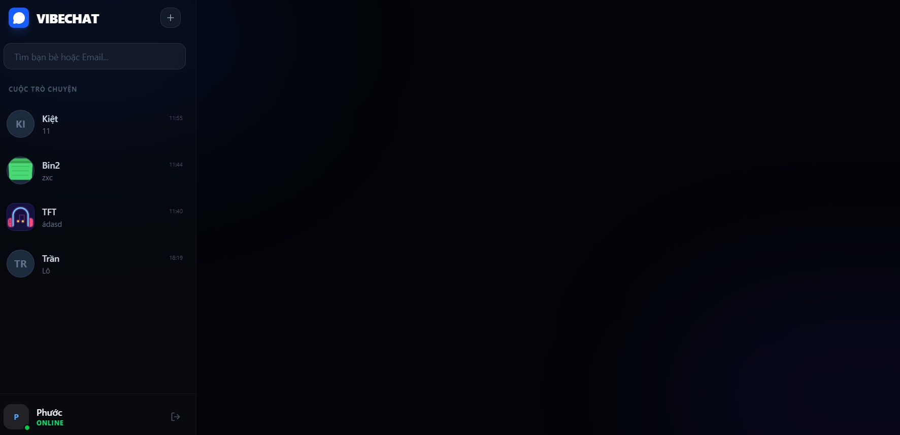

# VIBECHAT 💬

Ứng dụng nhắn tin thời gian thực (React + Firebase) hỗ trợ:
- Nhắn tin tức thời (Real-time)
- Đăng nhập Google & Email
- Quản lý danh sách bạn bè & Profile

## Demo
[https://ais-pre-mpnvi5vumhzfu6uqatlspi-804737011583.asia-southeast1.run.app](https://ais-pre-mpnvi5vumhzfu6uqatlspi-804737011583.asia-southeast1.run.app)

## Tech stack
- React 18 + TypeScript
- Firebase (Firestore & Auth)
- Tailwind CSS
- Framer Motion (motion/react)

### Setup environment
1. Sao chép `.env.example` thành `.env`
2. Điền các thông tin cấu hình Firebase từ Firebase Console

### Start App
```bash
npm install
npm run dev
```

## Environment Variables
Cần cấu hình các biến sau trong tệp `.env`:
- `VITE_FIREBASE_API_KEY`: API Key của Firebase
- `VITE_FIREBASE_AUTH_DOMAIN`: Auth Domain
- `VITE_FIREBASE_PROJECT_ID`: Project ID
- `VITE_FIREBASE_STORAGE_BUCKET`: Storage Bucket
- `VITE_FIREBASE_MESSAGING_SENDER_ID`: Messaging Sender ID
- `VITE_FIREBASE_APP_ID`: App ID
- `VITE_FIREBASE_DATABASE_ID`: Database ID 

## Features
- **Real-time Messaging**: Nhận tin nhắn tức thì bằng Firestore Snapshot
- **Authentication**: Hỗ trợ đăng nhập qua Google và Email/Password
- **Profile Management**: Cập nhật ảnh đại diện và tên hiển thị
- **Friend Search**: Tìm kiếm người dùng và tạo cuộc trò chuyện mới
- **UI/UX**: Giao diện hiện đại, mượt mà với Framer Motion và Tailwind CSS

## Screenshots

